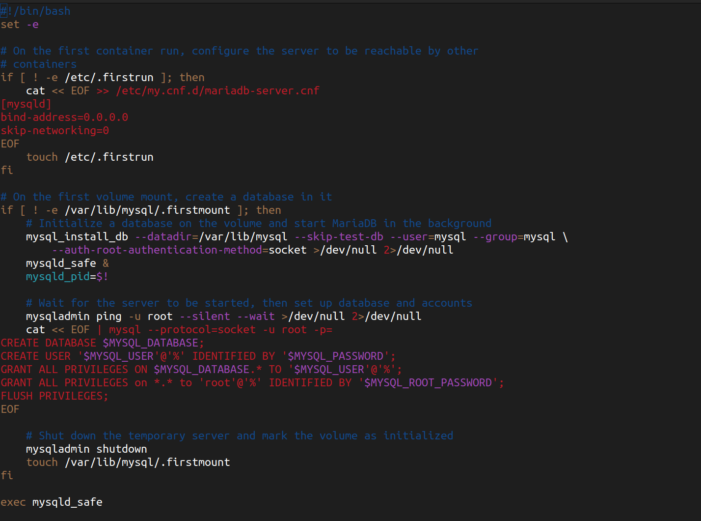

# Guide how to set Mariadb Docker Container

## Table Of Contents

- [Setting Up the Working Directory Tree](#setting-up-the-working-directory-tree)
- [Changing Owner and Permissions](#changing-owner-and-permissions)
- [Setting Up MariaDB](#setting-up-mariadb)
- [Dockerfile for MariaDB Container](#dockerfile-for-mariadb-container)
- [Mariadb Shell Script Explanation](#shell-script-explanation)
- [Environment Variables for MariaDB and WordPress Setup](#environment-variables-for-mariadb-and-wordpress-setup)
- [Setting Up Other Containers](#setting-up-other-containers)


## Setting up first the working directory tree

Create a file named Dockerfile in a directory called mariadb. This file will contain instructions for building the MariaDB image. Here's a basic example:

Install MariaDB
Go to home directory and inside the user create a folder inception and inside we will create the folder src and and the Makefile

	sudo mkdir inception

Inside Inception go and create all the folders and files inside as described in the subject, meaning also their rights. In the project has a picture like below giving an example on how it should be. I'm creating it first as it is in the example but later since im also doing the bonus im going to modify it.


1. Which means inside the root directory which I choosed home inside my VM:

	sudo mkdir srcs && sudo touch Makefile
		
2. Navigate to srcs 

		cd srcs && sudo touch docker-compose.yml .env  && sudo mkdir requirements

3. Navigate to requirements

		cd requirements && sudo mkdir bonus mariadb nginx tools wordpress

4. Inside MariaDB

		cd mariadb && sudo mkdir conf tools && sudo touch Dockerfile .dockerignore

5. Inside nginx

		cd ../nginx && sudo mkdir conf tools && sudo touch Dockerfile .dockerignore

 6. We navigate back and check if the structure is the same

		cd ../../../ && ls -alR

If you can see everything is structured in the way it should be, except that the rights of the directories and files are not the same as in the subject lets go and change them:

## Changing Owner and Permissions

1. Change Owner

		sudo chown -R eseferi:eseferi srcs
		sudo chown -R eseferi:eseferi .
		sudo chown -R eseferi:eseferi ..

2. Change Permissions

		sudo chmod 775 .
		sudo chmod 1777 ..
		sudo chmod 664 Makefile
		sudo chmod 775 srcs

Explanation
Change Owner:

The first three commands change the owner and group of directories.
sudo chown -R eseferi:eseferi srcs: Changes ownership of srcs directory.
sudo chown -R eseferi:eseferi .: Changes ownership of the current directory and its contents.
sudo chown -R eseferi:eseferi ..: Changes ownership of the parent directory and its contents.
Change Permissions:

The next commands adjust directory and file permissions.
sudo chmod 775 .: Sets permissions of the current directory to allow read, write, and execute for the owner and group, and read and execute for others.
sudo chmod 1777 ..: Sets permissions of the parent directory with a sticky bit, allowing only the owner or root to delete or rename files.
sudo chmod 664 Makefile: Sets permissions of the Makefile to allow read and write for the owner and group, and read-only for others.
sudo chmod 775 srcs: Sets permissions of the srcs directory to allow read, write, and execute for the owner and group, and read and execute for others.


The same you did here navigate to all the files and directory and change the ownerships and the rights of the file.


So now we should have a final look like below:


In my case since im doing the bonus, which means i will have an extra folder inside the requirements called bonus, and also for some services since im using a bashscript as entrypoint for my dockerfiles(I will explain below what "Entrypoint" does even mean when ill explain the DockerFiles) i didnt even create a conf folder for some of the services because didnt need them.

So my Working directory after the tree command looks like this 


## Setting Up Mariadb

### Dockerfile for MariaDB Container

Open with vim Dockerfile inside Mariadb

	vim ~/Inception/srcs/requirements/mariadb/Dockerfile

And write everything as the photo below:


1. Use the specified version of Alpine

```dockerfile
FROM alpine:3.19.2
```

Explanation: This line specifies the base image for your Docker container. `alpine:3.19.2` refers to Alpine Linux version 3.19.2, which is a lightweight Linux distribution known for its small size and efficiency. Using a specific version ensures consistency and predictability in your container environment.

2. Install MariaDB and Dependencies

```dockerfile
RUN apk update && apk add mariadb mariadb-client bash
```

Explanation: This `RUN` command updates the Alpine package index (`apk update`) and installs MariaDB (`mariadb`), MariaDB client tools (`mariadb-client`), Bash (`bash`).

3. Copy The executable script that we have prepared to configure the mariadb container in the way we sant. We are going to execute it later in this file from the ENTRYPOINT command

```dockerfile
COPY tools/mariadb-entrypoint.sh /usr/local/bin/
```

Explanation: This command copies from the host machine the executable script `tools/mariadb-entrypoint.sh` into the container's into the containers `/usr/local/bin/` directory so we can execute it from inside container. Configuration files include settings like MariaDB server options (`my.cnf`) and related files needed for MariaDB to run with your specified configurations.

5. Change permissions of the executable file

```dockerfile
RUN chmod +x /usr/local/bin/mariadb-entrypoint.sh
```

Explanation: After we copied inside container the executable script we have to be sure that this executable file as permissions inside the container to be executed by Running `chmod +x` on the executable file  `mariadb-entrypoint.sh`.

6. Setting up the container environme by choosing a file as a Entrypoint

```dockerfile
ENTRYPOINT [ "mariadb-entrypoint.sh" ]
```
Explanation:
- `ENTRYPOINT`: Sets the script (`docker-entrypoint.sh`) to be executed first when the container starts. It typically performs initialization tasks, such as setting up the database environment.

Summary:
Your Dockerfile effectively sets up a MariaDB container with necessary configurations, scripts, environment variables, and health checks. It ensures that MariaDB is initialized correctly and runs smoothly in a containerized environment. Adjustments may be needed based on specific project requirements or security considerations, but overall, it provides a solid foundation for deploying MariaDB with Docker.


## Shell Script Explanation

Now lets have a look at the entrypoint executable file

	vim ~/Inception/srcs/requirements/mariadb/tools/mariadb-entrypoint.sh

And write inside the file as in the image below




The bash script is designed to initialize a MariaDB server container. It handles first-time setup to configure the server for networking and initializes the database with specified user accounts and permissions. By using conditional checks and ensuring proper execution flow, the script sets up a MariaDB environment suitable for containerized deployment.

Here is a breakdown of the script's functionality:

1. `#!/bin/bash`: This line indicates that the script should be executed using the Bourne Again shell (/bin/bash).

2. `set -e`: This option ensures that the script exits immediately if any command exits with a non-zero status, except in certain contexts like conditional statements or command pipelines.

3. `if [ ! -e /etc/.firstrun ]; then`: This conditional statement checks if the file /etc/.firstrun does not exist. If true, it indicates that this is the first time the container is being run.

4. `cat << EOF >> /etc/my.cnf.d/mariadb-server.cnf`: Appends configuration settings to mariadb-server.cnf to ensure that the MariaDB server binds to all IP addresses (0.0.0.0) and enables networking.

	- `[mysqld]`: Specifies that the following lines are configuration settings for the MariaDB daemon.
	- `bind-address=0.0.0.0`: Configures the server to listen on all IP addresses.
	- `skip-networking=0`: Enables networking for the MariaDB server.

5. `touch /etc/.firstrun`: Creates an empty file at /etc/.firstrun to indicate that the first-run configuration has been completed.

6. `if [ ! -e /var/lib/mysql/.firstmount ]; then`: This block runs if the file /var/lib/mysql/.firstmount does not exist, indicating that the database volume is being mounted for the first time.

7. `mysql_install_db --datadir=/var/lib/mysql --skip-test-db --user=mysql --group=mysql --auth-root-authentication-method=socket >/dev/null 2>/dev/null`: Initializes the MariaDB database in the specified data directory (/var/lib/mysql) with the appropriate user and group settings. The output is suppressed for cleaner logs.

8. `mysqld_safe &`: Starts the MariaDB server in the background using mysqld_safe.

9. `mysqld_pid=$!`: Stores the process ID of the MariaDB server started in the background in mysqld_pid.

10. `mysqladmin ping -u root --silent --wait >/dev/null 2>/dev/null`: Waits for the MariaDB server to start by continuously pinging it. The output is suppressed for cleaner logs.

11. `cat << EOF | mysql --protocol=socket -u root -p=`: Uses a here document to pipe SQL commands to the MariaDB server. These commands include creating a database, setting up a user, and granting privileges.

	 - `CREATE DATABASE $MYSQL_DATABASE;`: Creates a new database with the name specified by the MYSQL_DATABASE environment variable.
	 - `CREATE USER '$MYSQL_USER'@'%' IDENTIFIED BY '$MYSQL_PASSWORD';`: Creates a new user with the name specified by the MYSQL_USER environment variable and the password specified by the MYSQL_PASSWORD environment variable.
	 - `GRANT ALL PRIVILEGES ON $MYSQL_DATABASE.* TO '$MYSQL_USER'@'%';`: Grants all privileges on the newly created database to the specified user.
	 - `GRANT ALL PRIVILEGES on *.* to 'root'@'%' IDENTIFIED BY '$MYSQL_ROOT_PASSWORD';`: Grants all privileges to the root user for remote access using the password specified by the MYSQL_ROOT_PASSWORD environment variable.
	 - `FLUSH PRIVILEGES;`: Reloads the privilege tables to ensure the changes take effect.

12. `mysqladmin shutdown`: Shuts down the temporary MariaDB server.

13. `touch /var/lib/mysql/.firstmount`: Creates an empty file at /var/lib/mysql/.firstmount to indicate that the volume has been initialized.

14. `exec mysqld_safe`: Replaces the current shell with the mysqld_safe process, effectively running the MariaDB server in safe mode for better error handling.

This script ensures that the MariaDB server container is properly configured and initialized, allowing for a smooth deployment of MariaDB in a containerized environment.

Note: all the variables used in the script like $MYSQL_USER $MYSQL_PASSWORD $MYSQL_DATABASE $MYSQL_ROOT_PASSWORD are specified in the ~/Inception/srcs/.env file because we are not allowed to push in our repo the credentials, we can just store it localy in our .env file and I have created ~/Inception/srcs/.gitignore file written inside .env, which is a rule not allowing to push the .env file, but in my reapo i will have it since im goint to show you the examples.

## Environment Variables for MariaDB and WordPress Setup

These environment variables are used to configure the MariaDB database and WordPress application during the container initialization process. They ensure that the services are set up with the correct credentials and settings.

### General Settings
- `DOMAIN_NAME=eseferi.42.fr`: This variable sets the domain name for your application. It is used to configure the URL at which your services (e.g., WordPress) will be accessible.

### MariaDB Configuration
- `MYSQL_USER=eseferi`: This variable sets the username for the MariaDB database. It is used to create a new database user with this name.
- `MYSQL_PASSWORD=1234`: This variable sets the password for the MariaDB user specified by MYSQL_USER.
- `MYSQL_DATABASE=mariadb`: This variable specifies the name of the database to be created in MariaDB.
- `MYSQL_ROOT_PASSWORD=1234`: This variable sets the password for the root user in MariaDB. The root user has administrative privileges and can perform any operation on the database.

### WordPress Configuration
- `WORDPRESS_TITLE=Inception`: This variable sets the title of your WordPress site.
- `WORDPRESS_ADMIN_USER=Admin`: This variable sets the username for the WordPress admin user. The admin user has full control over the WordPress site.
- `WORDPRESS_ADMIN_PASSWORD=1234`: This variable sets the password for the WordPress admin user.
- `WORDPRESS_ADMIN_EMAIL=admin991@gmail.com`: This variable sets the email address for the WordPress admin user. This email is used for administrative purposes, such as password recovery.
- `WORDPRESS_USER=eseferi`: This variable sets the username for a regular WordPress user. This user will have permissions as specified in the WordPress setup.
- `WORDPRESS_PASSWORD=1234`: This variable sets the password for the regular WordPress user specified by WORDPRESS_USER.
- `WORDPRESS_EMAIL=user@gmail.com`: This variable sets the email address for the regular WordPress user. This email can be used for account notifications and password recovery.

### FTP Configuration (Bonus)
- `FTP_USER=ftpuser`: This variable sets the username for the FTP (File Transfer Protocol) service. FTP is used for transferring files to and from the server.
- `FTP_PASSWORD=1234`: This variable sets the password for the FTP user specified by FTP_USER.

These environment variables provide the necessary configuration for setting up MariaDB and WordPress in Inception project. Adjust the values according to your specific requirements and project setup.

## Setting Up Other Containers
Check the other links below for setting up the other services

1. Mandatory
    - [Setting up the system and the virtual machine](README.md#table-of-contents)
    - [Mariadb container set up](Mariadb.md#table-of-contents)
    - [Nginx container set up](Nginx.md#table-of-contents)
    - [Wordpress container set up](Wordpress.md#table-of-contents)
2. Bonus
    - [Redis](Redis.md#table-of-contents)
    - [Ftp](Ftp.md#table-of-contents)
    - [Adminer](Adminer.md#table-of-contents)
    - [Portainer](Portainer.md#table-of-contents)
    - [Static Site](Static-Site.md#table-of-contents)
3. DockerCompose and Makefile
    - [Running our Docker Network](Compilation.md#table-of-contents)
4. Project Subject
    - [Inceptrion's Subject](Inception.pdf)