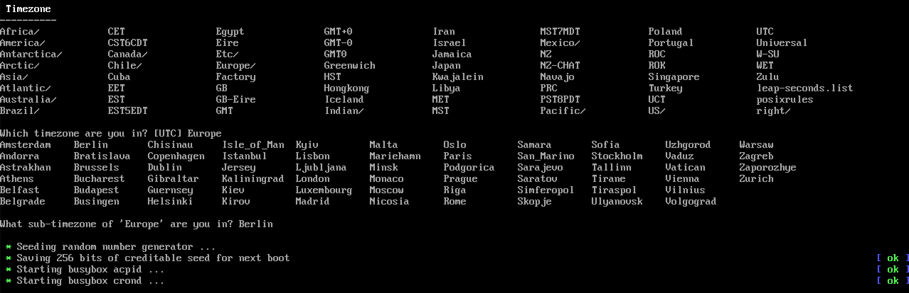
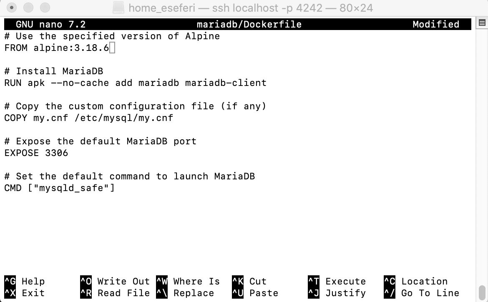

# Inception-Guide
Learn to set up Docker containers &amp; Nginx with Alpine Linux. Follow our step-by-step guide for a seamless setup process. Start hosting your apps confidently!

# Choosing between Alpin Linux and Debian

Based on the requirements and considerations outlined in the project specifications, the best choice in my opinion will be Alpin Linux. Here's why:

➊ Performance

    Alpine Linux is known for its small size and minimalistic approach, which results in smaller Docker images compared to Debian.
    Since performance matters are emphasized in project requirements, choosing Alpine can help optimize resource usage and improve
    container performance.
➋ Security

    Alpine Linux is designed with security in mind and has a smaller attack surface compared to Debian. This aligns well with the
    security considerations mentioned in the project requirements.
➌ Docker Image Building

    We are required to write our own Dockerfiles and build Docker images ourself. Alpine's simplicity and minimalism can make it
    easier to create lightweight and efficient Docker images.
➍ TLS Configuration with NGINX

    Our project requires setting up an NGINX container with TLSv1.2 or TLSv1.3 only. Since Alpine Linux provides NGINX packages and
    has a smaller footprint, it may be easier to configure and manage NGINX with Alpine.
➎ Volume and Network Configuration

    Alpine Linux support Docker volume and network configurations just like Debian, so there shouldn't be any significant differences
    in setting upvolumes and networks between the two distributions.
➏ Project Requirements

    Our project specifications do not explicitly favor Debian over Alpine or vice versa. Both distributions meet the project's
    requirments, but Alpine's smaller size, security features, and suitability for containerized environments make it a strong 
    candidate for this project.

Therefore, based on the outlined project requirements and considerations, Alpine Linux would be the recommended choice from my side to
use for your Docker containers.

# STEP1: Dowload the VirtualBox

If you do not have installed VirtualBox you can go at this link https://www.virtualbox.org/ and download it. We will need to use 
it to install the operating system we want to use.

In case you are using Ubuntu 22.04 and want to dowload it from terminal follow this lines to download:

➊ Update Package Lists 
Before installing any new software, it's a good idea to update your package lists to ensure you get the latest versions of available software.

    sudo apt update

➋ Install Required Dependencies 
VirtualBox requires some dependencies to be installed. Run the following command to install them:

    sudo apt install build-essential dkms linux-headers-$(uname -r)

➌ Add VirtualBox Repository 
Next, add the VirtualBox repository to your system. This is necessary to get the latest version of VirtualBox.

    sudo add-apt-repository multiverse

➍ Download and Import Oracle public key

    wget -q https://www.virtualbox.org/download/oracle_vbox_2016.asc

➎ Move the key to the trusted keyring directory

    sudo mv oracle_vbox_2016.asc /etc/apt/trusted.gpg.d/

➏ Add VirtualBox Repository

    sudo add-apt-repository "deb [arch=amd64] https://download.virtualbox.org/virtualbox/debian $(lsb_release -cs) contrib"

➐ Update Package Lists

    sudo apt update

➑ Install VirtualBox

    sudo apt install virtualbox

➒ Optional: Install VirtualBox Extension Pack

    wget https://download.virtualbox.org/virtualbox/6.1.30/Oracle_VM_VirtualBox_Extension_Pack-6.1.30.vbox-extpack
sudo vboxmanage extpack install Oracle_VM_VirtualBox_Extension_Pack-6.1.30.vbox-extpack

Start VirtualBox

    virtualbox

If it doesn't accept the command type

    sudo apt install virtualbox-qt

And the you can start virtual from terminal

    virtualbox

# STEP2: Install Alpin

➊ Download Alpine Linux ISO 

	Go to the Alpine Linux downloads page where we have the release branches: https://alpinelinux.org/releases/, so we can dowload 
	the penultimate stable version of Alpine Download the ISO image suitable for your VirtualBox virtual machine (e.g., x86_64).
	The penultimate stable version means not the last stable version but the second stable version.

➋ So now we go here https://alpinelinux.org/downloads/ scroll down in the end of the page and click at "Older releases are found <u>here</u>"

➌ Since we saw that the latest stable version was 3.18 we click on that

➍ Within the "release/" directory, you'll find what we need.

➎ Look for the appropriate subdirectory containing the packages for the x86_64 architecture. (Well this is mos suitable in my case).

➏ You'll see a list of files corresponding to different Alpine Linux packages. Look for the ISO image file, which typically has a name 
like "alpine-virt-3.18.0-x86_64.iso  " or similar.
alpine-virt-3.18.0-x86_64.iso   - This is the standard edition of Alpine Linux version 3.18 for x86_64 architecture. It is a 190MB ISO file.

➌ Virtualbox setting up

Open virtualbox and press ate the New section

It will open a window where you have to fill the filds for the name and OS like below and press 
continue

Now it will require the memory to allocate.
We'll need to allocate memory within VirtualBox for our virtual machine. Here's a summary:

-NGINX Container: Allocate between 128MB to 256MB of memory. 
-WordPress Container: Allocate between 512MB to 1GB of memory. 
-MariaDB Container: Allocate between 256MB to 512MB of memory. 
-Considering these recommendations and the overall memory requirements, you'll need at least 1GB to 2GB of memory for your virtual machine in total. This should provide enough resources for Inception project, assuming a relatively small to medium workload.

In VirtualBox, you can allocate memory when creating a new virtual machine or adjust it later in the 
virtual machine settings. Aim for a total allocation that is within the range mentioned above and 
fits your available system resources on your Pc. Adjustments can always be made based on performance 
and resource usage during testing and deployment.

Choose Create a virtual hard disk now

Choose first option since we downloaded an ISO file

For Hard Disk Memory 30 GB is more than enough for this project

Now you should see something like below

Now we have to choose the disk file we downloaded by going to 1.settings, 2.storage 3.Empty and at the atributes we click at the disk icon and click choose disk file

Choose the alpin disk image we dowloaded in the beggining

In the image above there is the latest image iso, but I changed that later as I explained
previosly in this tutorial, depended from the time you are doing this project you have to choose always
the second latest stable version starting with virt for your virtual machine.

Start Machine

Press Start

when it oppen the screen it will ask for the local host login where you initially have to put root

Use the setup-alpine command to configure Alpine Linux after installation
It will first ask for keyboard layout. Choose us and then again us

After it will promt asking for the Hostname and the interface, and if we want to do any manual configuration of the network which we will put no
because nothing is not required. Choose for hostname eseferi.42.fr. Follow the example below:

A new password is required for the root, and confirmation for it

TimeZone is required, since I'm in Germany I typed Europe and then Berlin

Then it will be the sections of Proxy, Network Time Protocol and APK Mirror every default is ok so proceed by typing enter for each one of them 

If you have something like the format below for the mirror 

you can type more and choose f which means Detect and add fastest mirror from above list

Follow like below for the user section

Add disk section we will type sda and that we would like to use it as sys, so we can use the disk as the root filesystem. This option will 
set up the disk in a traditional manner suitable for a small infrastructure composed of different services as specified in the project requirements.

Remove first the iso file before reboot so it will reboot base on what we did not based on the ISO image file

After type Reboot and you shoould see and sign in like below, with user and the password we set before

Now lets install doas (is replacement for sudo comand) and configure it if you want to configure. or if you want sudo follow the next foto

	apk update - update the package index to ensure you get the latest version of sudo
	apk add doas - install doas
	vi /etc/doas.conf

	vi /etc/apk/repositories
	Uncomment alpine.mirror.wearetriple. om/v3/18/community

	apk update
	apk add sudo

Installatation and Configuration of SSH

🔒 SSH, or Secure Shell, is both a protocol and a program used for remote access to servers. It establishes a secure channel, encrypting all data exchanged between the client and server. This ensures confidentiality and integrity, making SSH a vital tool for secure remote administration and file transfer. It is installed by default from the installation, also OpenSSh.

Now we have to eddit with vi or if you want nano firs

	sudo apk update
	sudo apk add nano
	sudo nano /etc/ssh/sshd_config

Or if you want with vi
	sudo vi /etc/ssh/sshd_config 
	
provided by OpenSSH to this link
https://exampleconfig.com/view/openssh-alpine3-etc-ssh-sshd_config. if it is empty 
try to reinstall openssh with this command 

	sudo apk add --force openssh

After opening the file we should uncomment the port and make it 4242 and uncomment PermitRootLogin and set it to no

Now we must edit the file /etc/ssh/ssh_config by uncommenting the port

	sudo vi /etc/ssh_config/
	

Finally we need to restart the ssh service 

	sudo rc-service sshd restart

To check if it is listening from 4242 we can see with this command

	netstat -tuln | grep 4242

Now lets go and add the port 4242 to our vm

And press on the button to add a port

Now lets connect with ssh from our terminal. Open terminal and type

	ssh localhost -p 4242

If you instead get an error like this below

Go and type in the terminal 

	nano ~/.ssh/known_hosts

And delite the line that start with local host

save and try again

	ssh localhost -p 4242

Super you are connected now lets continue with the next steps.

Now I suggest to you before continuing to the next step to research a little bit for docker containers at this link https://docs.docker.com/manuals/.

# STEP2: Install Docker and Docker Compose

First update Alpine, if you downloaded and using sudo you can use sudo instead of doas

Go sudo nano /etc/apk/repositories and uncomment the commented repos 

Install Docker and Docker Compose

	sudo apk add docker docker-compose

apk update
If you want to understand why we uncomented the repos read this note below taken from this website https://docs.genesys.com/Documentation/System/latest/DDG/InstallationofDockeronAlpineLinux

run

	sudo apk add --update docker openrc

To start the Docker daemon at boot, run

	sudo rc-update add docker boot

or

	rc-update add docker default

Execute 

	service docker status 
	
to ensure the status is running. If it is stoped type

	sudoe service docker start

and check again 

	service docker status

Connecting to the Docker daemon through its socket requires you to add yourself to the docker group

	sudo addgroup username docker

To use Docker Compose, we have to install it:

	sudo apk add docker-cli-compose

Naming Docker Images and Services:

Each Docker image must have the same name as its corresponding service. For example, if you have a service named nginx, the Docker image for that service should also be named nginx.

## Write the Dockerfile for MariaDB:

Create a file named Dockerfile in a directory called mariadb. This file will contain instructions for building the MariaDB image. Here's a basic example:

Install MariaDB
Go to home directory and create a folder inception

inside it create a folder called mariadb

Create an empty file inside mariadb called Dockerfile

	nano inception/mariadb/Dockerfile

And write inside 

	# Use the specified version of Alpine
	FROM alpine:3.18.6

	# Install MariaDB
	RUN apk --no-cache add mariadb mariadb-client

	# Copy the custom configuration file (if any)
	COPY my.cnf /etc/mysql/my.cnf

	# Expose the default MariaDB port
	EXPOSE 3306

	# Set the default command to launch MariaDB
	CMD ["mysqld_safe"]

	FROM alpine:3.18.6: This line specifies the base image for your Docker image. It tells Docker to use the Alpine Linux version 3.18.6 image as the starting point for building your custom image. Alpine Linux is a lightweight Linux distribution, and the version 3.18.6 is specifically chosen in this case.

	RUN apk --no-cache add mariadb mariadb-client: This line installs the MariaDB server (mariadb) and client (mariadb-client) packages using the apk package manager. The --no-cache flag tells apk not to cache the index locally, which helps to keep the Docker image smaller.

	COPY my.cnf /etc/mysql/my.cnf: If you have a custom configuration file named my.cnf, this line copies it from your host machine into the Docker image at the specified location (/etc/mysql/my.cnf). This allows you to customize the MariaDB configuration within the Docker container.

	EXPOSE 3306: This line exposes port 3306, the default port used by MariaDB, to allow communication with other containers or external services. However, it does not actually publish the port to the host machine. You would need to use the -p option with docker run to publish ports to the host.

	CMD ["mysqld_safe"]: This line sets the default command that will be executed when a container is started from this image. In this case, it starts the MariaDB server in safe mode (mysqld_safe). You can override this command when running the container if needed.