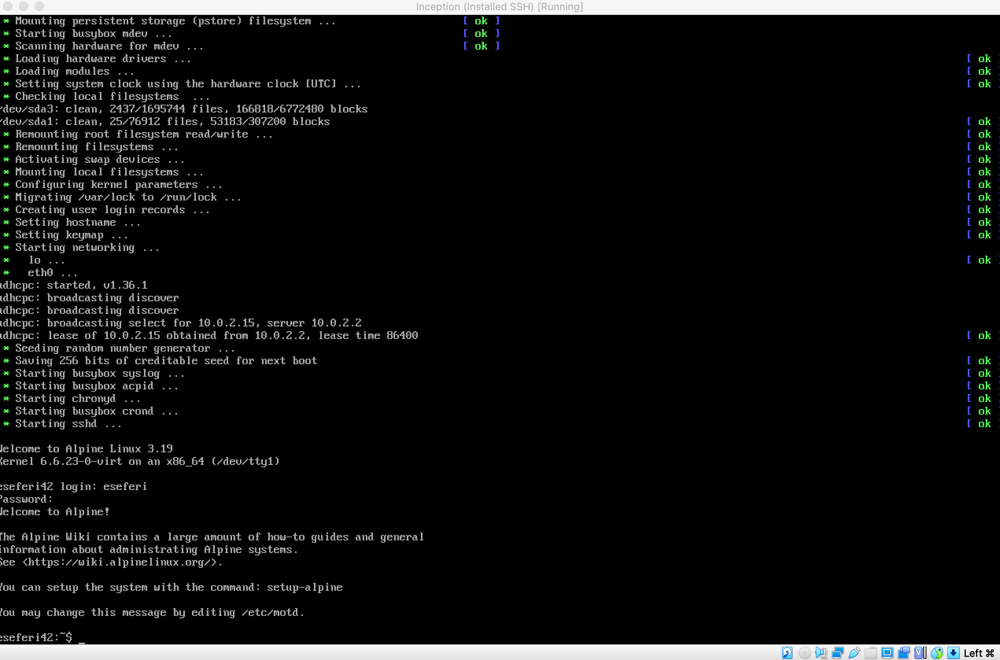
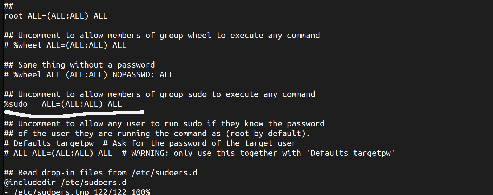
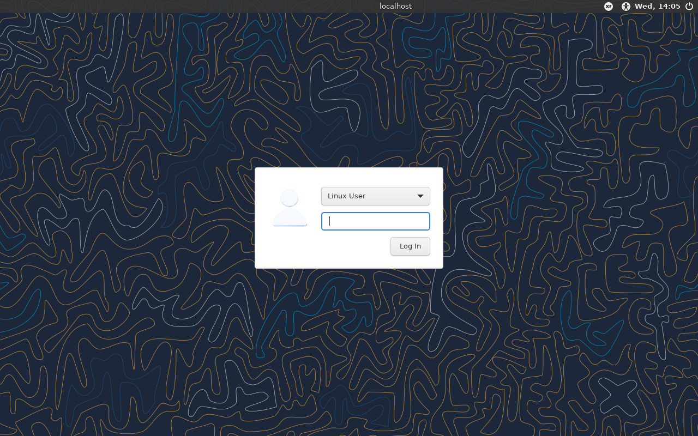

# Inception-Guide
Learn to set up Docker containers &amp; Nginx with Alpine Linux. Follow our step-by-step guide for a seamless setup process. Start hosting your apps confidently!

## Table of Contents

1. [Choosing between Alpine Linux and Debian](#choosing-between-alpin-linux-and-debian)
2. [Dowload the VirtualBox](#download-the-virtualbox)
3. [Install Alpine Linux](#install-alpine-linux)
4. [Installation and Configuration of SSH](#installation-and-configuration-of-ssh)
5. [Install Docker and Docker Compose](#install-docker-and-docker-compose)
6. [Some Research](#some-research)
7. [Setting Up Other Containers](#setting-up-other-containers)

## Choosing between Alpin Linux and Debian

Based on the requirements and considerations outlined in the project specifications, the best choice in my opinion will be Alpin Linux. Here's why:

➊ Performance

    Alpine Linux is known for its small size and minimalistic approach, which results in smaller Docker images compared to Debian.
    Since performance matters are emphasized in project requirements, choosing Alpine can help optimize resource usage and improve
    container performance.
➋ Security

    Alpine Linux is designed with security in mind and has a smaller attack surface compared to Debian. This aligns well with the
    security considerations mentioned in the project requirements.
➌ Docker Image Building

    We are required to write our own Dockerfiles and build Docker images ourself. Alpine's simplicity and minimalism can make it
    easier to create lightweight and efficient Docker images.
➍ TLS Configuration with NGINX

    Our project requires setting up an NGINX container with TLSv1.2 or TLSv1.3 only. Since Alpine Linux provides NGINX packages and
    has a smaller footprint, it may be easier to configure and manage NGINX with Alpine.
➎ Volume and Network Configuration

    Alpine Linux support Docker volume and network configurations just like Debian, so there shouldn't be any significant differences
    in setting upvolumes and networks between the two distributions.
➏ Project Requirements

    Our project specifications do not explicitly favor Debian over Alpine or vice versa. Both distributions meet the project's
    requirments, but Alpine's smaller size, security features, and suitability for containerized environments make it a strong 
    candidate for this project.

Therefore, based on the outlined project requirements and considerations, Alpine Linux would be the recommended choice from my side to
use for your Docker containers.

## Download the VirtualBox

If you do not have installed VirtualBox you can go at this link https://www.virtualbox.org/ and download it. We will need to use 
it to install the operating system we want to use.

In case you are using Ubuntu 22.04 and want to dowload it from terminal follow this lines to download:

➊ Update Package Lists</br>
Before installing any new software, it's a good idea to update your package lists to ensure you get the latest versions of available software.

    sudo apt update

➋ Install Required Dependencies</br>
VirtualBox requires some dependencies to be installed. Run the following command to install them:

    sudo apt install build-essential dkms linux-headers-$(uname -r)

➌ Add VirtualBox Repository</br>
Next, add the VirtualBox repository to your system. This is necessary to get the latest version of VirtualBox.

    sudo add-apt-repository multiverse

➍ Download and Import Oracle public key

    wget -q https://www.virtualbox.org/download/oracle_vbox_2016.asc

➎ Move the key to the trusted keyring directory

    sudo mv oracle_vbox_2016.asc /etc/apt/trusted.gpg.d/

➏ Add VirtualBox Repository

    sudo add-apt-repository "deb [arch=amd64] https://download.virtualbox.org/virtualbox/debian $(lsb_release -cs) contrib"

➐ Update Package Lists

    sudo apt update

➑ Install VirtualBox

    sudo apt install virtualbox

➒ Optional: Install VirtualBox Extension Pack

    wget https://download.virtualbox.org/virtualbox/6.1.30/Oracle_VM_VirtualBox_Extension_Pack-6.1.30.vbox-extpack
sudo vboxmanage extpack install Oracle_VM_VirtualBox_Extension_Pack-6.1.30.vbox-extpack

Start VirtualBox

    virtualbox

If it doesn't accept the command type

    sudo apt install virtualbox-qt

And the you can start virtual from terminal

    virtualbox

## Install Alpine Linux

➊ Download Alpine Linux ISO</br>

	Go to the Alpine Linux downloads page where we have the release branches: https://alpinelinux.org/releases/, so we can dowload 
	the penultimate stable version of Alpine Download the ISO image suitable for your VirtualBox virtual machine (e.g., x86_64).
	The penultimate stable version means not the last stable version but the second stable version.


➋ So now we go here https://alpinelinux.org/downloads/ scroll down in the end of the page and click at "Older releases are found <u>here</u>"


➌ Since we saw that the latest stable version was 3.18 we click on that


➍ Within the "release/" directory, you'll find what we need.


➎ Look for the appropriate subdirectory containing the packages for the x86_64 architecture. (Well this is mos suitable in my case).


➏ You'll see a list of files corresponding to different Alpine Linux packages. Look for the ISO image file, which typically has a name 
like "alpine-virt-3.18.0-x86_64.iso  " or similar.
alpine-virt-3.18.0-x86_64.iso   - This is the standard edition of Alpine Linux version 3.18 for x86_64 architecture. It is a 190MB ISO file.


➌ Virtualbox setting up

Open virtualbox and press ate the New section


It will open a window where you have to fill the filds for the name and OS like below and press 
continue


Now it will require the memory to allocate.
We'll need to allocate memory within VirtualBox for our virtual machine. Here's a summary:

-NGINX Container: Allocate between 128MB to 256MB of memory.</br>
-WordPress Container: Allocate between 512MB to 1GB of memory.</br>
-MariaDB Container: Allocate between 256MB to 512MB of memory.</br>
-Considering these recommendations and the overall memory requirements, you'll need at least 1GB to 2GB of memory for your virtual machine in total. This should provide enough resources for Inception project, assuming a relatively small to medium workload.

In VirtualBox, you can allocate memory when creating a new virtual machine or adjust it later in the 
virtual machine settings. Aim for a total allocation that is within the range mentioned above and 
fits your available system resources on your Pc. Adjustments can always be made based on performance 
and resource usage during testing and deployment.


Choose Create a virtual hard disk now


Choose first option since we downloaded an ISO file


For Hard Disk Memory 30 GB is more than enough for this project


Now you should see something like below


Now we have to choose the disk file we downloaded by going to 1.settings, 2.storage 3.Empty and at the atributes we click at the disk icon and click choose disk file


Choose the alpin disk image we dowloaded in the beggining


In the image above there is the latest image iso, but I changed that later as I explained
previosly in this tutorial, depended from the time you are doing this project you have to choose always
the second latest stable version starting with virt for your virtual machine.

Start Machine


Press Start


when it oppen the screen it will ask for the local host login where you initially have to put root


Use the setup-alpine command to configure Alpine Linux after installation
It will first ask for keyboard layout. Choose us and then again us


After it will promt asking for the Hostname and the interface, and if we want to do any manual configuration of the network which we will put no
because nothing is not required. Choose for hostname eseferi.42.fr. Follow the example below:


A new password is required for the root, and confirmation for it


TimeZone is required, since I'm in Germany I typed Europe and then Berlin


Then it will be the sections of Proxy, Network Time Protocol and APK Mirror every default is ok so proceed by typing enter for each one of them 


If you have something like the format below for the mirror 


you can type more and choose f which means Detect and add fastest mirror from above list


Follow like below for the user section


Add disk section we will type sda and that we would like to use it as sys, so we can use the disk as the root filesystem. This option will 
set up the disk in a traditional manner suitable for a small infrastructure composed of different services as specified in the project requirements.


Remove first the iso file before reboot so it will reboot base on what we did not based on the ISO image file


After type Reboot and you shoould see and sign in like below, with user and the password we set before



Now lets install sudo

	vi /etc/apk/repositories

Uncomment alpine.mirror.wearetriple. om/v3/18/community to allow to get packages from the repository


Now change as a root with the command

	su -
 
And install sudo
```
apk update
apk add sudo
```

And write 
	
	sudo visudo

In the file uncomment the part where sudo has privileges by removing the hash symbol



After this check if group sudo exist with the command

	getent group sudo

If no output is given it means that not. So we have to create the group and after add our user in the group:

	1- addgroup sudo
	2- adduser eseferi sudo

Where eseferi is the my username and sudo is the groupt. Now you are good to go to exercise sudo writes with your user.


## Installation and Configuration of SSH

🔒 SSH, or Secure Shell, is both a protocol and a program used for remote access to servers. It establishes a secure channel, encrypting all data exchanged between the client and server. This ensures confidentiality and integrity, making SSH a vital tool for secure remote administration and file transfer. It is installed by default from the installation, also OpenSSh.

Now we have to eddit with vi or if you want nano firs

	sudo apk update
	sudo apk add nano
	sudo nano /etc/ssh/sshd_config

Or if you want with vi
	sudo vi /etc/ssh/sshd_config 
	
provided by OpenSSH to this link
https://exampleconfig.com/view/openssh-alpine3-etc-ssh-sshd_config. if it is empty 
try to reinstall openssh with this command 

	sudo apk add --force openssh

After opening the file we should uncomment the port and make it 4242 and uncomment PermitRootLogin and set it to no


Now we must edit the file /etc/ssh/ssh_config by uncommenting the port

	sudo vi /etc/ssh/ssh_config/
	


Finally we need to restart the ssh service 

	sudo rc-service sshd restart


To check if it is listening from 4242 we can see with this command

	netstat -tuln | grep 4242


Now lets go and add the port 4242 to our vm


And press on the button to add a port


Now lets connect with ssh from our terminal. Open terminal and type

	ssh localhost -p 4242


If you instead get an error like this below


Go and type in the terminal 

	nano ~/.ssh/known_hosts

And delite the line that start with local host


save and try again

	ssh localhost -p 4242


Now that you are connected lets continue with the next steps.
We need also a user interface while I was reading the subject, because we will need to have a browser to see our results from wordpress. Follow this steps in your terminal to set up the UserInterface by installing the below commands:

	sudo apk add xorg-server xfce4 xfce4-terminal lightdm lightdm-gtk-greeter xf86-input-libinput elogind

1. xorg-server
Description: The X.Org Server (X11 server)
Purpose: Provides the core server package for the X Window System (X11), handling the display of graphics and managing input devices such as the keyboard and mouse.

2. xfce4
Description: XFCE Desktop Environment (Meta package)
Purpose: Installs the core components and basic applications of the XFCE desktop environment, which is lightweight, fast, and user-friendly while being low on system resources.

3. xfce4-terminal
Description: XFCE Terminal Emulator
Purpose: Provides the default terminal emulator for the XFCE desktop environment, allowing users to execute commands, run scripts, and manage their system via a command-line interface within a graphical window.

4. lightdm
Description: Light Display Manager
Purpose: Manages user logins and starts the X server, offering a graphical login screen. It is lightweight and highly configurable.

5. lightdm-gtk-greeter
Description: LightDM GTK+ Greeter
Purpose: Offers a GTK+ greeter for LightDM, which is the interface prompting users for login credentials. It is customizable to match the desktop environment's look and feel.

6. xf86-input-libinput
Description: X.Org libinput input driver
Purpose: Handles input devices like keyboards, mice, touchpads, and touchscreens. It is the recommended input driver for modern X.Org Server setups due to its better hardware support and features.

7. elogind
Description: Session Management Daemon
Purpose: Manages user sessions and switching. Elogind is a standalone logind implementation from systemd, providing essential session management features for systems not using the full systemd suite.

After we installed the packages we have to update the services and reboot the machine:

	setup-devd udev
	rc-update add elogind
	rc-update add lightdm
	reboot

And you should be able now to see something like below when you start the machine



Now I suggest to you before continuing to the next step to research a little bit for docker containers at this link https://docs.docker.com/manuals/.


## Install Docker and Docker Compose

A little bit of theory now:

### Docker

Docker is a platform as a service (PaaS) tool that utilizes OS-level virtualization to deploy software in containers. These containers are lightweight and allow applications to operate efficiently in diverse environments, isolated from one another.

### Background

Containers encapsulate their own software, libraries, and configuration files, communicating through well-defined channels while sharing the services of a single operating system kernel. This shared kernel reduces resource usage compared to traditional virtual machines.

### Operation

Docker utilizes various interfaces to access Linux kernel virtualization features. It packages applications and dependencies into virtual containers that can run on Linux, Windows, or macOS, enabling flexibility in deployment locations. Resource isolation features like cgroups and kernel namespaces allow containers to run within a single Linux instance.

### Components

The Docker software offering comprises:

1. Software
Docker daemon (dockerd) manages containers and handles container objects, while the Docker client (docker) provides a command-line interface (CLI) for user interaction.

2. Objects
Docker objects include images, containers, and services, providing a standardized environment for running applications.

		Docker containers are encapsulated environments for running applications, managed via the Docker API or CLI.

		Docker images are read-only templates used to build containers.

		Docker services enable scaling across multiple Docker daemons, forming a swarm of cooperating daemons.

		Registries: Docker registries store and distribute Docker images, with Docker Hub being the primary public registry. Registries allow for image download ("pull") and upload ("push") operations.

### Tools

1. Docker Compose: Defines and runs multi-container Docker applications using YAML configuration files. It simplifies container creation and startup processes.

2. Docker Swarm: Provides native clustering functionality for Docker containers, turning multiple Docker engines into a single virtual Docker engine.

3. Docker Volume: Facilitates data management for Docker containers, enabling data persistence and sharing between containers.

First update Alpine:

	sudo apk update && sudo apk upgrade

Type in Terminal
	
	sudo vim /etc/apk/repositories 

and uncomment the commented repos 


Install Docker and Docker Compose

	sudo apk add docker docker-compose


apk update
If you want to understand why we uncomented the repos read this note below taken from this website https://docs.genesys.com/Documentation/System/latest/DDG/InstallationofDockeronAlpineLinux


run

	sudo apk add --update docker openrc


To start the Docker daemon at boot, run

	sudo rc-update add docker boot

or

	rc-update add docker default

Execute 

	service docker status 
	
to ensure the status is running. If it is stoped type

	sudoe service docker start

and check again 

	service docker status

Connecting to the Docker daemon through its socket requires you to add yourself to the docker group

	sudo addgroup username docker

To use Docker Compose, we have to install it:

	sudo apk add docker-cli-compose


Naming Docker Images and Services:

Each Docker image must have the same name as its corresponding service. For example, if you have a service named nginx, the Docker image for that service should also be named nginx.


Based on project guidelines, it's better to set up MariaDB first before setting up NGINX and the other services. Here's why:

#### Dependency Order

MariaDB is a fundamental component as it serves as the database backend for your WordPress website. Therefore, it makes sense to set up the database first before configuring other services that rely on it.

#### Data Volume

You need to set up volumes for the WordPress database and website files. Since MariaDB manages the database, you should create the volume for the database first to ensure it's properly configured and accessible before configuring the volume for the website files.

#### Configuration Interdependencies

Configuring MariaDB may require specific settings or initializations that could be referenced or utilized by other services like NGINX or WordPress. By setting up MariaDB first, you ensure that these configurations are in place before configuring other services.

Therefore, the suggested order would be:

1. Set up MariaDB.
2. Set up NGINX.
3. Set up WordPress and other services (if applicable), ensuring they are configured to interact with MariaDB as needed.
4. Configure volumes for the database and website files accordingly.

## Some Research

<h3>What is Docker file?</h3>
<p>
	The Dockerfile employs DSL (Domain Specific Language) and comprises directives for building a Docker image. It delineates the steps to efficiently craft an image. When developing your application, ensure the Dockerfile's sequence aligns with the Docker daemon's execution, as it processes instructions sequentially, from top to bottom
</p>
<h3>What is Docker Image?</h3>
<p>
	An artifact representing multiple layers and serving as a lightweight, self-contained executable package is referred to as a Docker image. It encapsulates all necessary components to execute software, encompassing the code, runtime, libraries, environment variables, and configuration files.
</p>
<h3>What is Docker Container?</h3>
<p>
	A container is a live instance of a Docker image at runtime. It operates as an isolated environment, containing all the dependencies and configurations required for the application it hosts. Containers streamline both development and deployment processes, enhancing efficiency by ensuring the application runs independently from the host environment.
</p>

### Dockerfile Commands/Instructions

1. **FROM**
	- Represents the base image(OS), which is the command that is executed first before any other commands.
	- **Syntax:**
		```
		FROM <ImageName>
		```
	- **Example:** 
		The base image will be alpine: 3.18 Operating System.
		```
		FROM alpine: 3.18
		```

2. **COPY**
	- The COPY command in Dockerfile is utilized to copy files or directories from the host machine into the Docker image during the build process.
	- **Syntax:**
		```
		COPY <Source> <Destination>
		```
	- **Example:**
		Let's say we have a custom configuration file called "nginx.conf" located in the "conf" directory of our project. We want to include this configuration file into our NGINX Docker image:
		```
		COPY conf/nginx.conf /etc/nginx/nginx.conf
		```

3. **ADD**
	- The ADD command in Dockerfile serves the purpose of downloading files from remote HTTP/HTTPS sources and adding them to the Docker image during the build process.
	- **Syntax:**
		```
		ADD <URL>
		```
	- **Example:**
		Suppose we need to include the WordPress installation package directly from its official website into our Docker image:
		```
		ADD https://wordpress.org/latest.tar.gz /var/www/html/wordpress.tar.gz
		```
	- In this example:
		- "https://wordpress.org/latest.tar.gz" is the URL of the latest WordPress installation package.
		- "/var/www/html/wordpress.tar.gz" is the destination path within the Docker image where we want to store the downloaded WordPress package.

4. **RUN**
	- The RUN command in Dockerfile enables us to execute shell commands and scripts during the image build process. These commands are executed within the container environment, allowing us to perform various tasks like installing packages, configuring software, or setting up the environment.
	- **Syntax:**
		```
		RUN <Command + ARGS>
		```
	- **Example:**
		Suppose we need to install necessary software dependencies for our Alpine-based MariaDB container:
		```
		RUN apk update && apk add --no-cache mariadb mariadb-client
		```
	- In this example:
		- "apk update" updates the package index before installing.
		- "apk add --no-cache" installs MariaDB server and MariaDB client without caching the index and keeping the image size minimal.

5. **CMD**
	- The CMD instruction in a Dockerfile defines the default command to be executed when the container starts. It specifies the executable and any arguments that should be passed to it. If a Docker container is started without specifying a command, the command specified by CMD will be executed by default.
	- **Syntax:**
		```
		CMD [command + args]
		```
	- **Example:**
		Let's say we want to set the default command for a container running a custom Python script:
		```
		CMD ["python", "app.py"]
		```
	- In our project, to specify the default command for starting the MariaDB server:
		```
		CMD ["mysqld", "--user=mysql", "--init-file=/tmp/init.sql"]
		```
	- This command starts the MariaDB server with the specified options and initializes it with the SQL commands provided in the init.sql file.

6. **ENTRYPOINT**
	- The ENTRYPOINT instruction in a Dockerfile configures a container to run as an executable. When a Docker container is started, the command or script specified by ENTRYPOINT is executed. Unlike CMD, the command specified by ENTRYPOINT cannot be overridden by specifying a command at runtime.
	- **Syntax:**
		```
		ENTRYPOINT [command + args]
		```
	- **Example:**
		For instance, to configure a container to run a custom script named run.sh:
		```
		ENTRYPOINT ["./run.sh"]
		```
	- In our project, to define the entrypoint for starting the MariaDB server:
		```
		ENTRYPOINT ["mysqld"]
        ```
	In our project we will be using bashscripts instead of configuration files because like this we can pas environment variables, and I kind of feel more comfortable doing so.
	

7. **MAINTAINER**
	- The MAINTAINER command in a Dockerfile allows us to specify the author or owner of the Dockerfile.

	- **Syntax:** 
		```
		MAINTAINER <AuthorName>
		```
  
	- **Example:** 
		Setting the author for the image.
		```
		MAINTAINER Erik <eseferi.student@42wolfsburg.de>
		```

## Setting Up Other Containers
Check the other links below for setting up the other services

1. Mandatory
    - [Setting up the system and the virtual machine](README.md#table-of-contents)
    - [Mariadb container set up](Mariadb.md#table-of-contents)
    - [Nginx container set up](Nginx.md#table-of-contents)
    - [Wordpress container set up](Wordpress.md#table-of-contents)
2. Bonus
    - [Redis](Redis.md#table-of-contents)
    - [Ftp](Ftp.md#table-of-contents)
    - [Adminer](Adminer.md#table-of-contents)
    - [Portainer](Portainer.md#table-of-contents)
    - [Static Site](Static-Site.md#table-of-contents)
3. DockerCompose and Makefile
    - [Running our Docker Network](Compilation.md#table-of-contents)
4. Project Subject
    - [Inceptrion's Subject](Inception.pdf)
