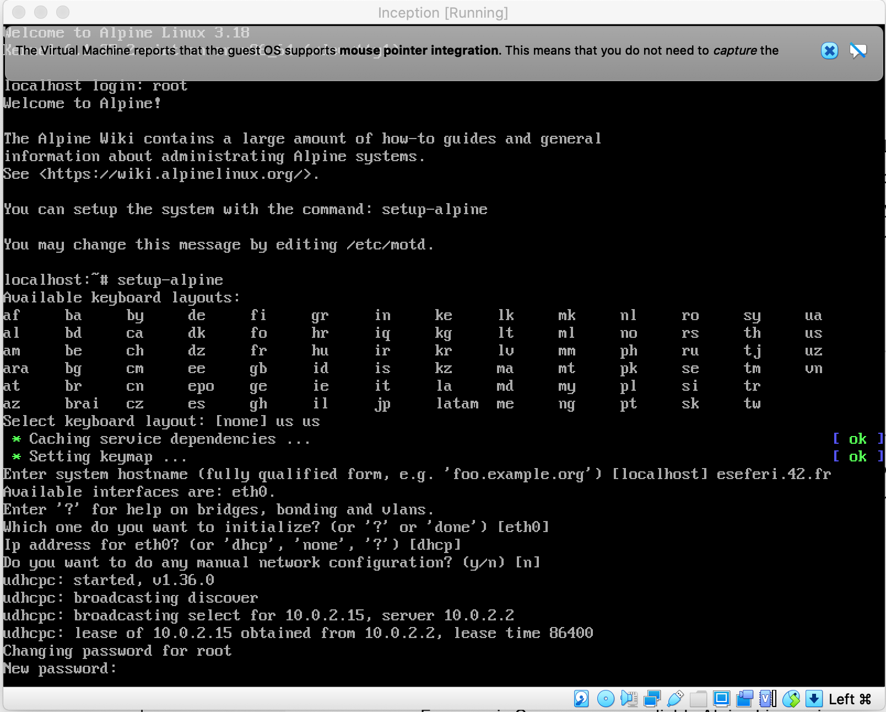

# Inception-Guide
Learn to set up Docker containers &amp; Nginx with Alpine Linux. Follow our step-by-step guide for a seamless setup process. Start hosting your apps confidently!

# Choosing between Alpin Linux and Debian

Based on the requirements and considerations outlined in the project specifications, the best choice in my opinion will be Alpin Linux. Here's why:

➊ Performance

    Alpine Linux is known for its small size and minimalistic approach, which results in smaller Docker images compared to Debian.
    Since performance matters are emphasized in project requirements, choosing Alpine can help optimize resource usage and improve
    container performance.
➋ Security

    Alpine Linux is designed with security in mind and has a smaller attack surface compared to Debian. This aligns well with the
    security considerations mentioned in the project requirements.
➌ Docker Image Building

    We are required to write our own Dockerfiles and build Docker images ourself. Alpine's simplicity and minimalism can make it
    easier to create lightweight and efficient Docker images.
➍ TLS Configuration with NGINX

    Our project requires setting up an NGINX container with TLSv1.2 or TLSv1.3 only. Since Alpine Linux provides NGINX packages and
    has a smaller footprint, it may be easier to configure and manage NGINX with Alpine.
➎ Volume and Network Configuration

    Alpine Linux support Docker volume and network configurations just like Debian, so there shouldn't be any significant differences
    in setting upvolumes and networks between the two distributions.
➏ Project Requirements

    Our project specifications do not explicitly favor Debian over Alpine or vice versa. Both distributions meet the project's
    requirments, but Alpine's smaller size, security features, and suitability for containerized environments make it a strong 
    candidate for this project.

Therefore, based on the outlined project requirements and considerations, Alpine Linux would be the recommended choice from my side to
use for your Docker containers.

# STEP1: Dowload the VirtualBox

If you do not have installed VirtualBox you can go at this link https://www.virtualbox.org/ and download it. We will need to use 
it to install the operating system we want to use.

In case you are using Ubuntu 22.04 and want to dowload it from terminal follow this lines to download:

➊ Update Package Lists 
Before installing any new software, it's a good idea to update your package lists to ensure you get the latest versions of available software.

    sudo apt update

➋ Install Required Dependencies 
VirtualBox requires some dependencies to be installed. Run the following command to install them:

    sudo apt install build-essential dkms linux-headers-$(uname -r)

➌ Add VirtualBox Repository 
Next, add the VirtualBox repository to your system. This is necessary to get the latest version of VirtualBox.

    sudo add-apt-repository multiverse

➍ Download and Import Oracle public key

    wget -q https://www.virtualbox.org/download/oracle_vbox_2016.asc

➎ Move the key to the trusted keyring directory

    sudo mv oracle_vbox_2016.asc /etc/apt/trusted.gpg.d/

➏ Add VirtualBox Repository

    sudo add-apt-repository "deb [arch=amd64] https://download.virtualbox.org/virtualbox/debian $(lsb_release -cs) contrib"

➐ Update Package Lists

    sudo apt update

➑ Install VirtualBox

    sudo apt install virtualbox

➒ Optional: Install VirtualBox Extension Pack

    wget https://download.virtualbox.org/virtualbox/6.1.30/Oracle_VM_VirtualBox_Extension_Pack-6.1.30.vbox-extpack
sudo vboxmanage extpack install Oracle_VM_VirtualBox_Extension_Pack-6.1.30.vbox-extpack

Start VirtualBox

    virtualbox

If it doesn't accept the command type

    sudo apt install virtualbox-qt

And the you can start virtual from terminal

    virtualbox

# STEP2: Install Alpin

➊ Download Alpine Linux ISO 

	Go to the Alpine Linux downloads page: https://alpinelinux.org/downloads/
	Download the ISO image suitable for your VirtualBox virtual machine (e.g., x86_64).

➋ Virtualbox setting up

Open virtualbox and press ate the New section

It will open a window where you have to fill the filds for the name and OS like below and press 
continue

Now it will require the memory to allocate.
We'll need to allocate memory within VirtualBox for our virtual machine. Here's a summary:

-NGINX Container: Allocate between 128MB to 256MB of memory. 
-WordPress Container: Allocate between 512MB to 1GB of memory. 
-MariaDB Container: Allocate between 256MB to 512MB of memory. 
-Considering these recommendations and the overall memory requirements, you'll need at least 1GB to 2GB of memory for your virtual machine in total. This should provide enough resources for Inception project, assuming a relatively small to medium workload.

In VirtualBox, you can allocate memory when creating a new virtual machine or adjust it later in the 
virtual machine settings. Aim for a total allocation that is within the range mentioned above and 
fits your available system resources on your Pc. Adjustments can always be made based on performance 
and resource usage during testing and deployment.

Choose Create a virtual hard disk now

Choose first option since we downloaded an ISO file

For Hard Disk Memory 30 GB is more than enough for this project

Now you should see something like below

Now we have to choose the disk file we downloaded by going to 1.settings, 2.storage 3.Empty and at the atributes we click at the disk icon and click choose disk file

Choose the alpin disk image we dowloaded in the beggining

Start Machine

Press Start

when it oppen the screen it will ask for the local host login where you initially have to put root

Use the setup-alpine command to configure Alpine Linux after installation
It will first ask for keyboard layout. Choose us and then again us

After it will promt asking for the Hostname and the interface, and if we want to do any manual configuration of the network which we will put no
because nothing is not required. Follow the example below

A new password is required for the root, and confirmation for it

TimeZone is required, since I'm in Germany I typed Europe and then Berlin

Then it will be the sections of Proxy, Network Time Protocol and APK Mirror every default is ok so proceed by typing enter for each one of them 

Follow like below for the user section

Add disk section we will type sda and that we would like to use it as sys, so we can use the disk as the root filesystem. This option will 
set up the disk in a traditional manner suitable for a small infrastructure composed of different services as specified in the project requirements.

type reboot after the installation.